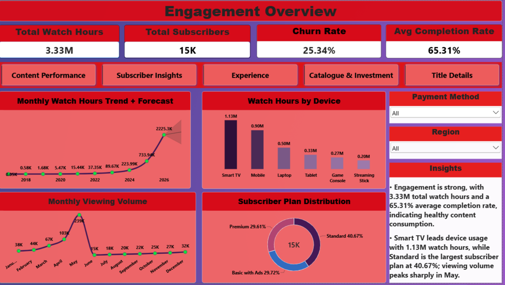
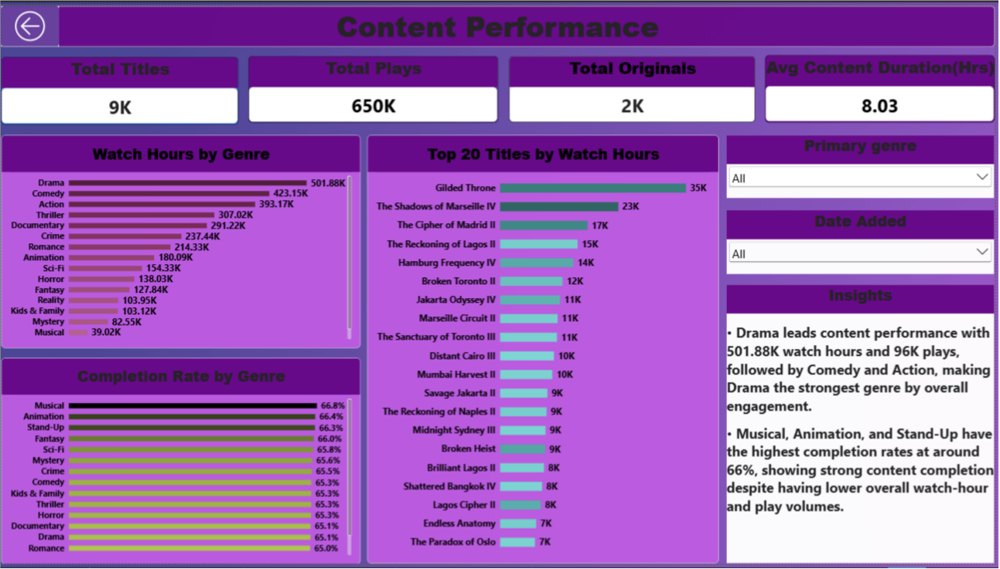
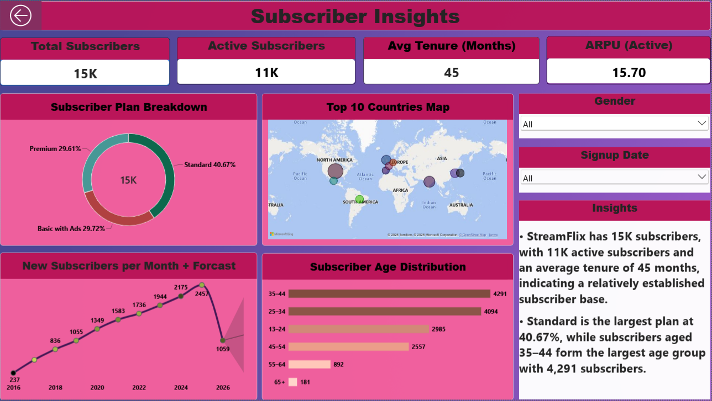
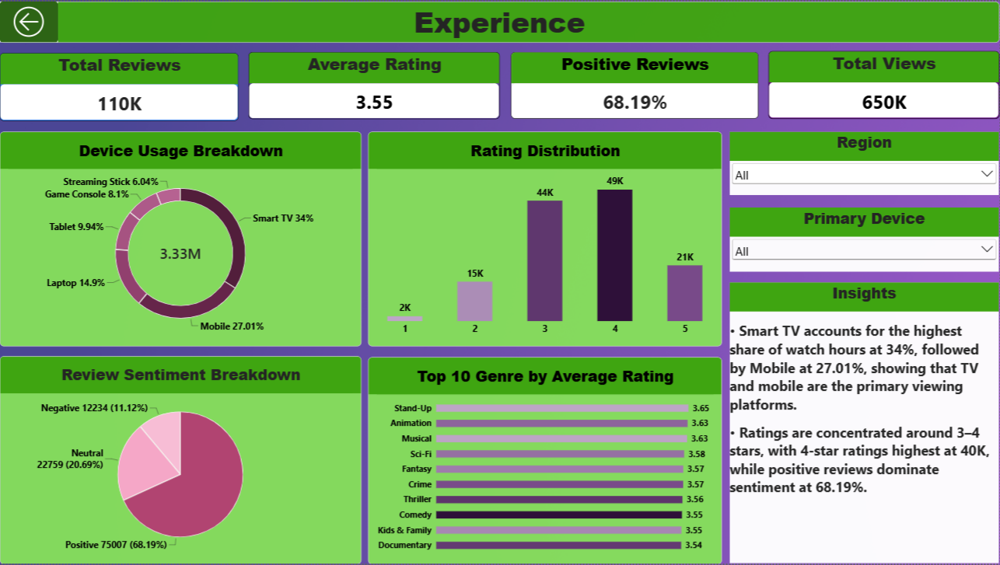
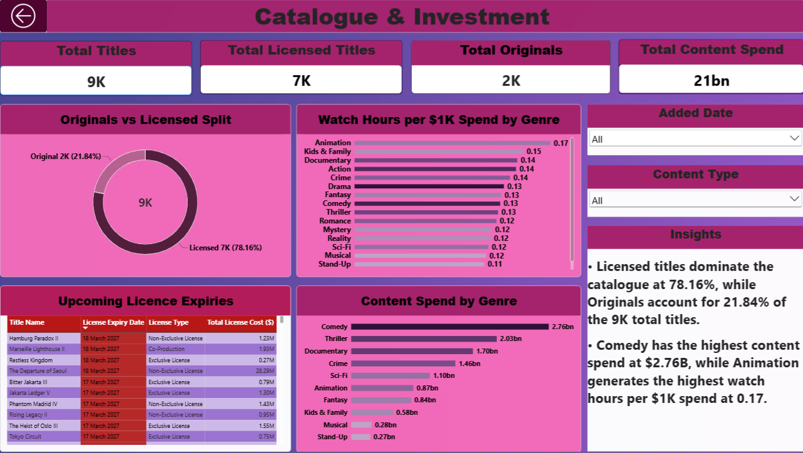
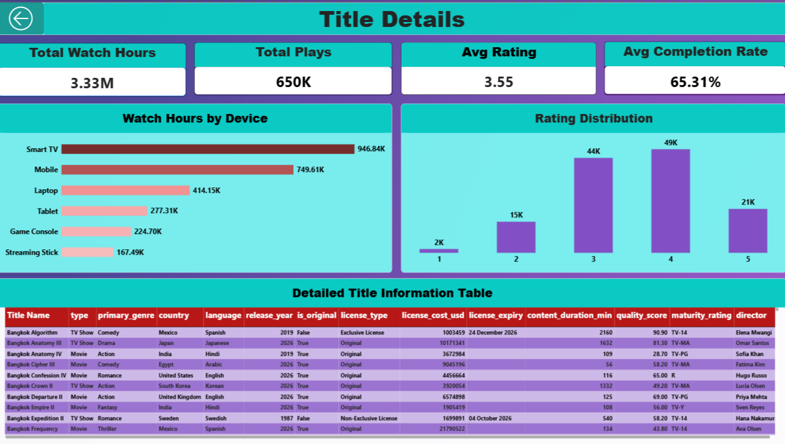

# StreamFlix Content Analytics

An end-to-end data analytics project focused on **subscriber engagement, content performance, retention, customer experience, and content investment** for a fictional streaming platform, StreamFlix.

The project covers the complete analytics workflow using **Python, SQL (MySQL), and Power BI**, followed by a management-level report and an optional cohort retention analysis.

---

## Project Overview

StreamFlix contains six related datasets covering subscribers, titles, viewing activity, ratings, reviews, and watchlists.

The objective was to transform raw data into actionable business insights around:

- Subscriber engagement and retention
- Content performance
- Viewing behavior
- Customer experience and sentiment
- Content investment and licensing
- Key business KPIs
- Cohort-based subscriber retention

---

## Tools & Technologies

- **Python** — Pandas, Matplotlib
- **SQL** — MySQL
- **Power BI** — Data modeling, DAX measures, interactive dashboards, slicers, tooltips and drill-through
- **Jupyter Notebook** — Data cleaning, EDA and cohort analysis

---

## Dataset

The project uses six related tables:

| Table | Description |
|---|---|
| `subscribers` | Subscriber profile, plan, pricing, tenure and churn information |
| `titles` | Content catalogue, genre, country, licensing, cost and performance |
| `watch_history` | Viewing sessions, watch duration, completion and device |
| `ratings` | Subscriber ratings from 1–5 |
| `reviews` | Written reviews and sentiment |
| `watchlist` | Subscriber watchlist activity and watched status |

The project includes the dataset package in **`Datasets.zip`**.

---

# Project Workflow

## Phase 1 — Data Quality & Cleaning

The first phase focused on validating the quality and consistency of all six datasets.

### Key checks performed

- Loaded and profiled all six CSV files
- Checked missing values
- Checked duplicate records
- Validated data types
- Converted date columns
- Checked watch-duration anomalies
- Validated referential integrity
- Validated churn dates
- Checked active subscriber/churn-date consistency
- Validated completion percentage
- Checked review sentiment values
- Checked watchlist references
- Reviewed short-tenure active subscribers

A **Data Quality Report** was also prepared to summarize the findings.

---

## Phase 2 — Exploratory Data Analysis

Python and Matplotlib were used to explore viewing, subscriber and content behavior.

### Analysis included

- Monthly viewing volume
- Monthly watch hours and year-over-year trend
- Watch hours by genre
- Content type split
- Top countries by watch hours
- Subscriber plan distribution
- Device usage
- Subscriber age distribution
- Completion rate by genre
- Review sentiment breakdown

The analysis identified patterns in **content consumption, subscriber behavior and viewing preferences**.

---

## Phase 3 — SQL KPI Analysis

The six tables were loaded into **MySQL** and business KPIs were calculated using SQL.

### KPIs calculated

- Total Watch Hours
- Active Rate
- Churn Rate
- Average Completion Rate
- Monthly Recurring Revenue (MRR)
- ARPU
- Average Watch Time per Subscriber
- Watchlist Conversion
- Hit Concentration
- Originals Share of Hours

---

# Phase 4 — Power BI Dashboard

A multi-page interactive Power BI dashboard was created to present the findings to management.

The dashboard includes **five main analytical pages plus a Title Details drill-through page**.

### 1. Engagement Overview

Focuses on overall platform engagement.

- Total Watch Hours
- Total Subscribers
- Churn Rate
- Average Completion Rate
- Monthly Watch Hours Trend
- Monthly Viewing Volume
- Watch Hours by Device
- Subscriber Plan Distribution
- Interactive slicers and navigation



---

### 2. Content Performance

Focuses on content consumption and title performance.

- Watch Hours by Genre
- Top Titles by Watch Hours
- Completion Rate by Genre
- Total Plays by Genre
- Content performance KPIs
- Genre and date filters



---

### 3. Subscriber Insights

Focuses on subscriber demographics and growth.

- Total Subscribers
- Active Subscribers
- Average Tenure
- ARPU
- Subscriber Plan Breakdown
- Top Countries
- New Subscribers per Month
- Subscriber Age Distribution
- Interactive demographic/date filters



---

### 4. Experience

Focuses on customer viewing experience and feedback.

- Total Reviews
- Average Rating
- Positive Review %
- Total Views
- Device Usage Breakdown
- Rating Distribution
- Review Sentiment Breakdown
- Top Genres by Average Rating
- Region and primary-device filters



---

### 5. Catalogue & Investment

Focuses on content catalogue structure and investment efficiency.

- Total Titles
- Licensed Titles
- Originals
- Total Content Spend
- Originals vs Licensed Split
- Watch Hours per $1K Spend by Genre
- Upcoming Licence Expiries
- Content Spend by Genre
- Added Date and Content Type filters



---

## Title Details — Drill-Through

A dedicated **Title Details** drill-through page was created to provide deeper analysis at title level.

It includes:

- Total Watch Hours
- Total Plays
- Average Rating
- Average Completion Rate
- Watch Hours by Device
- Rating Distribution
- Detailed Title Information Table

The detailed table provides fields such as title name, type, genre, country, language, release year, originality, licence type, licence cost, licence expiry, content duration, quality score, maturity rating and director.



---

# Key Business Findings

Some of the major findings from the analysis include:

- StreamFlix generated approximately **3.33M watch hours**.
- The platform has approximately **15K subscribers**, with around **11K active subscribers**.
- The reported **churn rate is 25.34%**.
- Average content completion is **65.31%**.
- **Drama** leads content consumption with approximately **501.88K watch hours**.
- **Smart TV** is the largest viewing device by watch hours, followed by Mobile.
- **Standard** is the largest subscriber plan at approximately **40.67%**.
- Positive reviews represent approximately **68.19%** of reviews.
- Licensed content represents approximately **78.16%** of the catalogue, while Originals represent **21.84%**.
- Total content spend is approximately **$21B**.
- **Animation** has the highest watch-hours-per-$1K-spend value in the analysis at approximately **0.17**.

---

# Bonus — Cohort Retention Analysis

An optional cohort analysis was completed using the subscriber table.

Subscribers were grouped by their **signup month**, and retention was measured at:

- **3 months**
- **6 months**
- **12 months**

The analysis uses `signup_date` and `churn_date` to calculate subscriber lifetime and retention by cohort.

This provides an additional view of **subscriber retention over time**.

---

# Management Report

A **Management Summary Report** was prepared for StreamFlix leadership covering:

- Executive Summary
- Top 3 Findings
- Risks Identified
- Opportunities
- Recommendations
- Conclusion

The report translates the analytical findings into plain-language business insights and actionable recommendations.

---

# Repository Contents

```text
StreamFlix-Content-Analytics/
│
├── Dashboard_Screenshots/
│   ├── Engagement_Overview.png
│   ├── Content_Performance.png
│   ├── Subscriber_Insights.png
│   ├── Experience.png
│   ├── Catalogue_&_Investment.png
│   └── Title_Details.png
│
├── Phase1_DataCleaning_Navdeep_Khandelwal.ipynb
├── Phase2_EDA_Navdeep_Khandelwal.ipynb
├── Phase3_KPIs_Load_Tables.sql
├── Phase3_KPIs_Navdeep_Khandelwal.sql
├── Phase4_Dashboard_Navdeep_Khandelwal.pbix
├── Phase4_Report_Navdeep_Khandelwal.pdf
├── Bonus_Cohort_Analysis_Navdeep_Khandelwal.ipynb
├── Datasets.zip
└── README.md
